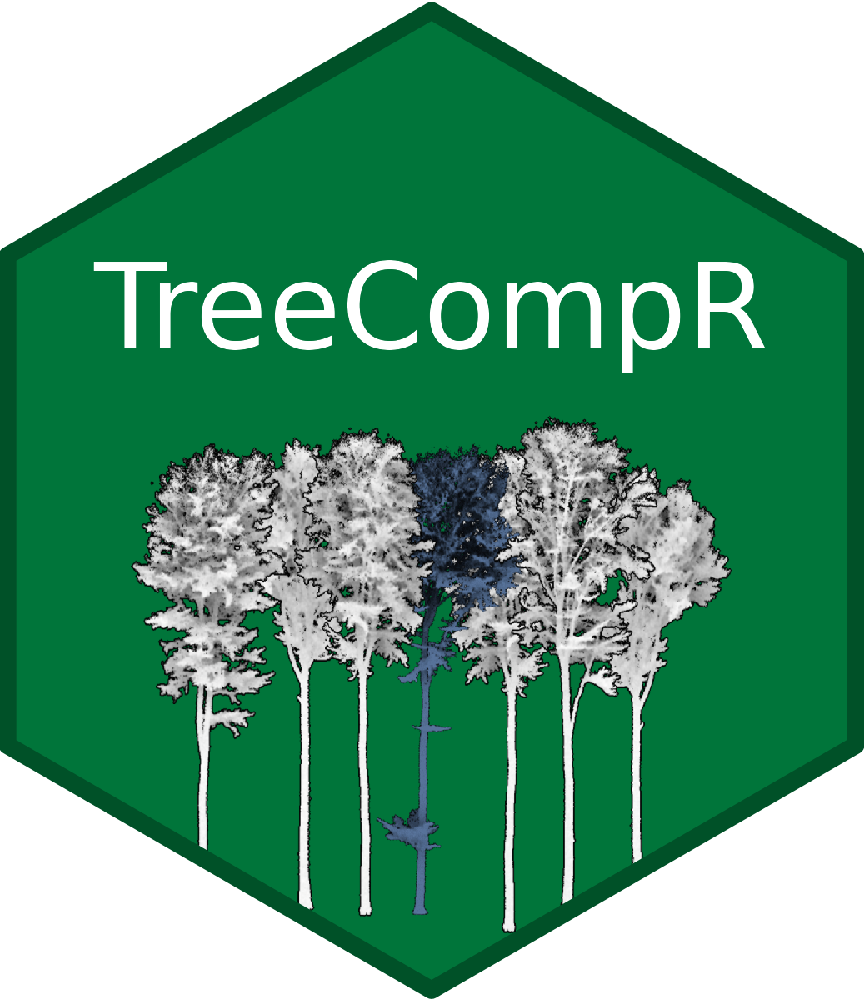

<!-- README.md is generated from README.Rmd. Please edit that file -->

# TreeCompR

<!-- badges: start -->


R Package for calculating distance-dependent individual Tree Competition
on Plot level

<!-- badges: end -->

This R package is designed for the quantitative analysis of individual
tree competition within forest ecosystems. It accepts inputs such as
LiDAR point clouds (as .txt or las/laz files) of forest plots and
individual target trees, or inventory tables (including tree ID, X, Y,
DBH, H). Through the use of various competition indices, it enables the
assessment and measurement of competition between trees, providing
valuable insights for forest ecology, inventories, and forest management
strategies. This package facilitates a systematic approach to
understanding interactions and resource competition among trees and
enables informed decision making in forest management.

## Installation

You can install the development version of TreeCompR from
[GitHub](https://github.com/) with:

``` r
# install.packages("devtools")
devtools::install_github("juliarieder/TreeCompR")
```

## Methodology

LiDAR point clouds can be used directly to quantify the competition
exerted by neighboring trees on the target tree. For this purpose, the
target tree for which the competition is to be determined should be
segmented beforehand. Since it is crucial whether a part of the point
cloud is classified as “competing” or as part of the target tree itself,
a manual segmentation (e.g. in CloudCompare) is most accurate.


## Example

This is how to quantify the competition for one target tree using the
cone method:

``` r
library(TreeCompR)
## insert path to point cloud of the forest plot and to the target tree point cloud
CI_cone <- competition_pc("tests/data/neighborhood.txt", "tests/data/tree.txt", "cone")
```
