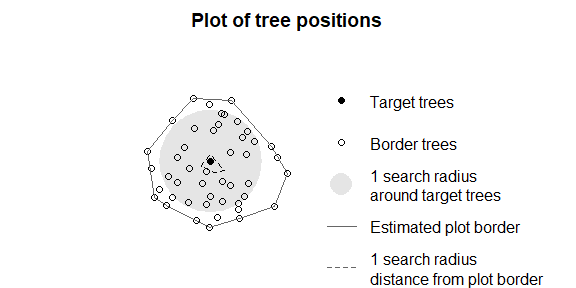

<!-- README.md is generated from README.Rmd. Please edit that file -->

# TreeCompR

<!-- badges: start -->


R Package for calculating distance-dependent or point cloud-based
individual tree competition indices

<!-- badges: end -->

This R package is designed for the quantitative analysis of individual
tree competition within forest ecosystems. It accepts inputs such as
LiDAR point clouds (as dataframe with xyz columns or las/laz files) of
forest plots and individual target trees, or inventory tables (including
tree ID, x, y, dbh and/or h). Through the use of various competition
indices, it enables the assessment and measurement of competition
between trees, providing valuable insights for forest ecology,
inventories, and forest management strategies. This package facilitates
a systematic approach to understanding interactions and resource
competition among trees and enables informed decision making in forest
management.

## Installation

You can install the development version of TreeCompR from
[GitHub](https://github.com/) with:

``` r
# install.packages("devtools")
devtools::install_github("juliarieder/TreeCompR", dependencies = TRUE, build_vignettes = TRUE)
```

## Overview

TreeCompR can read point clouds or inventory tables and quantifies tree
competition in different ways:

- `read_pc()` reads 3D point clouds in dataframe format or las/laz
  (already loaded or from file path)
- `read_inv()` reads and validates inventory tables from dataframes or
  reads the table directly from file path
- `define_target()` can be used to define for which trees within a plot
  the competition should be quantified in `compete_inv()`
- `plot_target()` check and validate the tree position(s) and the
  surrounding trees after defining them with `define_target()`
- `compete_pc()` quantifies tree competition from point clouds (methods:
  cone or cylinder)
- `compete_inv()`quantifies size- and distance-dependent competition
  using inventory data

## Methodology of point cloud-based approach

LiDAR point clouds can be used directly to quantify the competition
exerted by neighboring trees on the target tree. For this purpose, the
target tree for which the competition is to be determined should be
segmented beforehand. Since it is crucial whether a part of the point
cloud is classified as “competing” or as part of the target tree itself,
a manual segmentation (e.g. in CloudCompare) is most accurate.


# Example

This is how to quantify the competition with `compete_pc()` for one
target tree using the cone method (cone spanned in 60 % of target tree’s
height) or cylinder method with 5 m radius:

``` r
library(TreeCompR)
## insert path to point cloud of the forest plot and to the target tree point cloud
compete_pc(forest_source = "tests/testthat/testdata/neighborhood.txt", 
           tree_source = "tests/testthat/testdata/tree.txt", 
           comp_method = "cone",
           h_cone = 0.6)
#> ----- Processing competition indices for: tree -----
#>  ------------------------------------------------------------------
#>  Point cloud based competition indices for 'tree' 
#>  ------------------------------------------------------------------
#>   target height_target center_position CI_cone h_cone
#> 1   tree          22.8    crown center   16046    0.6
#>  ------------------------------------------------------------------
#>  Point cloud based competition indices for 'tree' 
#>  ------------------------------------------------------------------
#>   target height_target center_position CI_cone h_cone
#> 1   tree          22.8    crown center   16046    0.6
```

``` r
## or the cylinder method with radius 5 m
compete_pc(forest_source = "tests/testthat/testdata/neighborhood.txt", 
           tree_source = "tests/testthat/testdata/tree.txt", 
           comp_method = "cylinder", cyl_r = 5)
#> ----- Processing competition indices for: tree -----
#>  ------------------------------------------------------------------
#>  Point cloud based competition indices for 'tree' 
#>  ------------------------------------------------------------------
#>   target height_target center_position CI_cyl cyl_r
#> 1   tree          22.8    crown center 102169     5
#>  ------------------------------------------------------------------
#>  Point cloud based competition indices for 'tree' 
#>  ------------------------------------------------------------------
#>   target height_target center_position CI_cyl cyl_r
#> 1   tree          22.8    crown center 102169     5
```

## Size- and distance-dependent tree competition

Distance-dependent competition indices can be quantified using
`compete_inv()`

``` r
## check or define target trees: read inventory file, define targets, plot results
plot <- read_inv("tests/testthat/testdata/inventory.csv", verbose = FALSE)
targets <- define_target(plot,target_source = "buff_edge", radius = 10)
```

``` r
## plot the positions of the target trees and trees at the border
plot_target(targets)
```



``` r
## insert path to inventory table or insert dataframe object
compete_inv(inv_source = "tests/testthat/testdata/inventory.csv",
            target_source = "buff_edge",
            radius = 10, method = "all")
#> --------------------------------------------------------------------- 
#> 'compete_inv' class inventory with distance-based competition indices 
#> Collection of data for 1 target and 47 edge trees. 
#> Source of target trees: buffer around edge    Search radius: 10 
#> ---------------------------------------------------------------------
#>    id     x      y   dbh CI_Hegyi CI_RK1 CI_RK2
#> 44 48 0.102 -0.494 0.244     4.39   1.07   1.58
```
