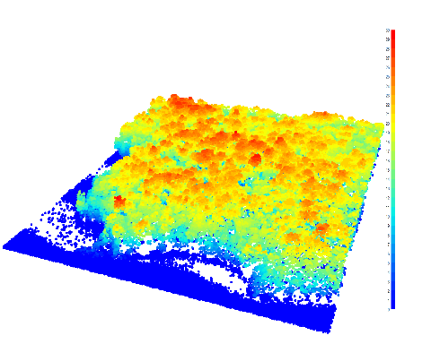
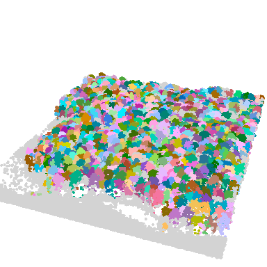
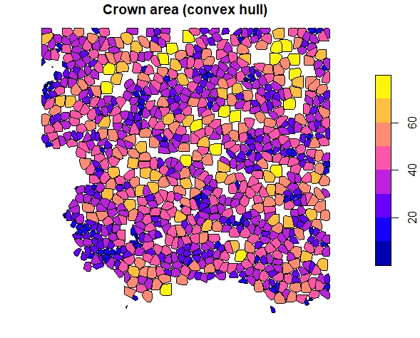
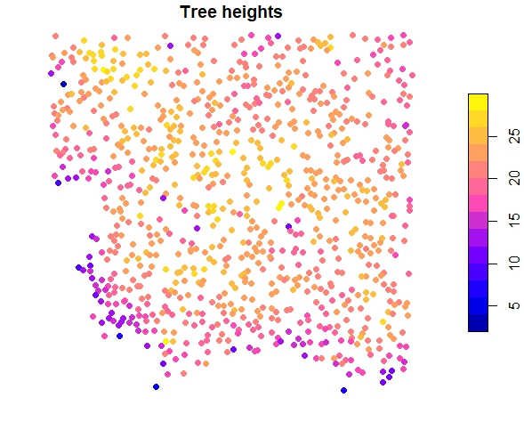
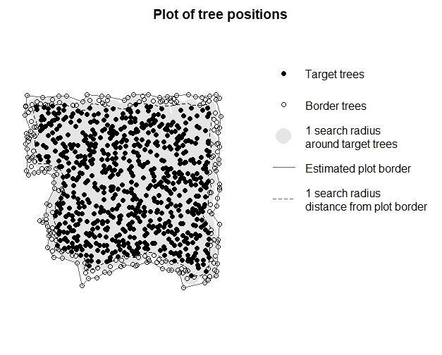

## Workflow for deriving size-distance-dependent competition indizes from ALS data

```{r, include = FALSE}
knitr::opts_chunk$set(
  collapse = TRUE,
  comment = "#>"
)
```
Airborne Laser Scanning is a powerful tool for forest management and research, offering accurate large-scale data. To quantify competition on the individual tree level, first the ALS point cloud needs to be pre-processed. For using the data in TreeCompR, we need to segment the trees and derive an inventory table. The package [`lidR`](https://CRAN.R-project.org/package=lidR) is a great option to load,inspect and process your ALS data and to segment individual trees. Check out the [lidRbook](https://r-lidar.github.io/lidRbook/) for their very nice detailed workflows and examples. 
```{r setup, message=FALSE, warning=FALSE}
library(lidR)
library(TreeCompR)
```

## Read the point cloud
The [`lidR`](https://CRAN.R-project.org/package=lidR) package can read various data formats. Read in the raw ALS point cloud. Here we show a workflow with the example data from the lidR package.

```{r LAS, message=FALSE, warning=FALSE, eval=FALSE}
LASfile <- system.file("extdata", "Megaplot.laz", package="lidR")
las <- readLAS(LASfile)
#print a summary
print(las)
```

Maybe just load xyz to save memory, in case you have a lot of parameters stored in your data, by using the optional parameter `select` within `readLAS()`.

```{r LAS1, message=FALSE, warning=FALSE, eval=FALSE}
las <- readLAS("file.las", select = "xyz")  # load XYZ only
```
And it is always good to check and validate your data using the `las_check()` function.
```{r LAS2, message=FALSE, warning=FALSE, eval=FALSE}
las_check(las)
```

## Plot your data
```{r LAS3, message=FALSE, warning=FALSE, eval=FALSE}
plot(las)
```


Please note, there are various options on individual tree segmentations (e.g. based on the [point cloud](https://r-lidar.github.io/lidRbook/itd-its.html#its-cloud) or [canopy height model](https://r-lidar.github.io/lidRbook/itd-its.html#its-chm)). Be aware, that based on your own data, you might need to test the approaches and the results and check visually, if the results are realistic.

For a segmentation based on CHM, first the CHM needs to be generated:

```{r CHM, message=FALSE, warning=FALSE, eval=FALSE}
# create CHM raster from point cloud with 0.5 m resolution (adjust values if needed)
chm_p2r_05 <- rasterize_canopy(las, 0.5, p2r(subcircle = 0.2), pkg = "terra")

# Post-processing median filter
kernel <- matrix(1,3,3)
chm_p2r_05_smoothed <- terra::focal(chm_p2r_05, w = kernel, fun = median, na.rm = TRUE)

#locate tree tops
ttops_chm_p2r_05_smoothed <- locate_trees(chm_p2r_05_smoothed, lmf(5))
```
```{r CHM1, message=FALSE, warning=FALSE, eval=FALSE}
col <- height.colors(50)
plot(chm_p2r_05_smoothed, main = "CHM P2R 0.5 smoothed", col = col); plot(sf::st_geometry(ttops_chm_p2r_05_smoothed), add = T, pch =3)
```


## Segment the trees

```{r segment, message=FALSE, warning=FALSE, eval=FALSE}
algo <- dalponte2016(chm_p2r_05_smoothed, ttops_chm_p2r_05_smoothed)
las <- segment_trees(las, algo) # segment point cloud
plot(las, bg = "white", size = 4, color = "treeID") # visualize trees
```


## Get crown metrics

```{r crown-metrics, message=FALSE, warning=FALSE, eval=FALSE}
crowns <- crown_metrics(las, func = .stdtreemetrics, geom = "convex")
plot(crowns["convhull_area"], main = "Crown area (convex hull)")
```


```{r crown-metrics1, message=FALSE, warning=FALSE, eval=FALSE}
trees <- crown_metrics(las, func = .stdtreemetrics, geom = "point")
plot(trees["Z"], main = "Tree heights", pch = 16)
```


## Integration into TreeCompR
Extract a inventory table from the crown data:

```{r integrate, message=FALSE, warning=FALSE, eval=FALSE}
library(sf)
library(dplyr)
inventory <- trees %>%
  mutate(x = st_coordinates(.)[,1], y = st_coordinates(.)[,2]) %>%
  st_set_geometry(NULL)
```
validate the inventory table with `read_inv()` and define target trees (automatically) with `define_targets()` where trees at the edge of the plot or dataset (1 search radius away from plot edge) are automatically excluded for calculating CIs. 

```{r integrate1, message=FALSE, warning=FALSE, eval=FALSE}
inv_trees <- read_inv(inventory, height = Z, height_unit = "m")
targets_buff <- define_target(inv_trees, target_source = "buff_edge", radius = 10)
plot_target(targets_buff)
```


Now you can calculate the tree competition (size-distance-dependent) for your trees. Afterwards you can print your results, save the dataframe or plot the results according to your needs.
```{r integrate3, message=FALSE, warning=FALSE, eval=FALSE}
CI <- compete_inv(inv_source = inv_trees, target_source = "buff_edge", 
                  radius = 10, method = "all")
```

## plot the results

```{r plot-res, message=FALSE, warning=FALSE, eval=FALSE}
library(ggplot2)
ggplot(CI, aes(x = x, y = y, color = CI_Braathe)) +
  geom_point(size = 2, alpha = 0.7) + # Adjust point size and transparency
  scale_color_gradient(low = "yellow", high = "darkred", 
                       name = "CI Braathe") + # Customizing color scale
  theme_classic() + # Change the theme
  labs(title = "Competition based on tree heights and distance", 
       x = "X", y = "Y") + # Add title and axis labels
  theme(
    plot.title = element_text(hjust = 0.5), # Center the plot title
    legend.position = "right" # Position of the legend
  )
```


## Other options to pre-process the ALS point clouds
There are other packages available, e.g. the [`itcSegment`](https://rdrr.io/cran/itcSegment/) package. Within their function `itcLiDARallo()`, 
trees are being segmented based on typical allometric relations that can be defined beforehand. We also used this approach with the settings below to pre-process the MLS data in our manuscript "TreeCompR: Tree competition indices for inventory data and 3D point clouds". We used publicly available laser scanning datasets from the [Bavarian Agency for Digitisation, High-Speed Internet and Surveying](https://geodaten.bayern.de/opengeodata/OpenDataDetail.html?pn=laserdaten).

```{r itclidar, echo = TRUE, eval=FALSE}
library(itcSegment)


# create a lookup table with common height-crown diameter-relations 
# (example from itcSegment, also used in our case study)
lut <- data.frame(
  H = c(2, 10, 15, 20, 25, 30),
  CD = c(0.5, 1, 2, 3, 4, 5))

#create a digital terrain model
dtm <- grid_terrain(las = las, res = 0.5, algorithm = knnidw(k=10L, p=2))
plot(dtm)
#normalize the height of the las data by terrain
nlas <- las - dtm

# segment the trees (adjust epsg according to your coordinate reference system)
se<-itcLiDARallo(nlas$X,nlas$Y,nlas$Z,epsg=32632,lut=lut)
summary(se)
plot(se,axes=T)

#validate the output in TreeCompR
inv_trees <- read_inv(se, height = Height_m, height_unit = "m")
#quantify tree competition (adjust radius)
compete_inv(inv_source = inv_trees, target_source = "buff_edge", 
            radius = 13.5, method = "all")
```
