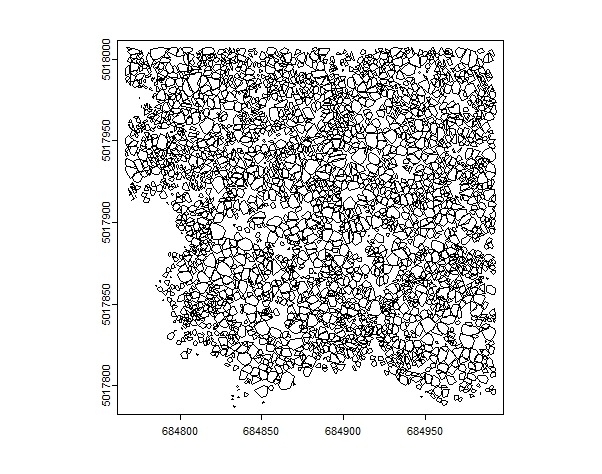

## Workflow for deriving size-distance-dependent competition indizes from ALS data

```{r, include=FALSE}
knitr::opts_chunk$set(
  collapse = TRUE,
  comment = "#>"
)
```

Airborne Laser Scanning is a powerful tool for forest management and research, offering accurate large-scale data. To quantify competition on the individual tree level, first the ALS point cloud needs to be pre-processed. For using the data in TreeCompR, we need to segment the trees and derive an inventory table. The package [`lidR`](https://CRAN.R-project.org/package=lidR) is a great option to load, inspect and process your ALS data and to segment individual trees. Check out the [lidRbook](https://r-lidar.github.io/lidRbook/) for their very nice detailed workflows and examples. 
```{r setup, message=FALSE, warning=FALSE, eval=FALSE}
library(lidR)
library(TreeCompR)
```

## Read the point cloud
The [`lidR`](https://CRAN.R-project.org/package=lidR) package can read various data formats. Read in the raw ALS point cloud. Here we show a workflow with the example data from the lidR package.

```{r LAS, message=FALSE, warning=FALSE, eval=FALSE}
LASfile <- system.file("extdata", "Megaplot.laz", package="lidR")
las <- readLAS(LASfile)
#print a summary
print(las)
```

Maybe just load xyz to save memory, in case you have a lot of parameters stored in your data, by using the optional parameter `select` within `readLAS()`.

```{r LAS1, message=FALSE, warning=FALSE, eval=FALSE}
las <- readLAS("file.las", select = "xyz")  # load XYZ only
```
And it is always good to check and validate your data using the `las_check()` function.
```{r LAS2, message=FALSE, warning=FALSE, eval=FALSE}
las_check(las)
```

## Plot your data
```{r LAS3, message=FALSE, warning=FALSE, eval=FALSE}
plot(las)
```


Please note, there are various options on individual tree segmentations (e.g. based on the [point cloud](https://r-lidar.github.io/lidRbook/itd-its.html#its-cloud) or [canopy height model](https://r-lidar.github.io/lidRbook/itd-its.html#its-chm)). Be aware, that based on your own data, you might need to test the approaches and the results and check visually, if the results are realistic.

For a segmentation based on CHM, first the CHM needs to be generated:

```{r CHM, message=FALSE, warning=FALSE, eval=FALSE}
# create CHM raster from point cloud with 0.5 m resolution (adjust values if needed)
chm_p2r_05 <- rasterize_canopy(las, 0.5, p2r(subcircle = 0.2), pkg = "terra")

# Post-processing median filter
kernel <- matrix(1,3,3)
chm_p2r_05_smoothed <- terra::focal(chm_p2r_05, w = kernel, fun = median, na.rm = TRUE)

#locate tree tops
ttops_chm_p2r_05_smoothed <- locate_trees(chm_p2r_05_smoothed, lmf(5))
```
```{r CHM1, message=FALSE, warning=FALSE, eval=FALSE}
# plot the CHM with the tree tops
col <- height.colors(50)
plot(chm_p2r_05_smoothed, main = "CHM P2R 0.5 smoothed", col = col); 
plot(sf::st_geometry(ttops_chm_p2r_05_smoothed), add = T, pch =3)
```


## Segment the trees

```{r segment, message=FALSE, warning=FALSE, eval=FALSE}
algo <- dalponte2016(chm_p2r_05_smoothed, ttops_chm_p2r_05_smoothed)
las <- segment_trees(las, algo) # segment point cloud
plot(las, bg = "white", size = 4, color = "treeID") # visualize trees
```


## Get crown metrics

```{r crown-metrics, message=FALSE, warning=FALSE, eval=FALSE}
crowns <- crown_metrics(las, func = .stdtreemetrics, geom = "convex")
plot(crowns["convhull_area"], main = "Crown area (convex hull)")
```


```{r crown-metrics1, message=FALSE, warning=FALSE, eval=FALSE}
trees <- crown_metrics(las, func = .stdtreemetrics, geom = "point")
plot(trees["Z"], main = "Tree heights", pch = 16)
```


## Integration into TreeCompR
Extract a inventory table from the crown data:

```{r integrate, message=FALSE, warning=FALSE, eval=FALSE}
library(sf)
library(dplyr)
inventory <- trees %>%
  mutate(x = st_coordinates(.)[,1], y = st_coordinates(.)[,2]) %>%
  st_set_geometry(NULL)
head(inventory)
#>    treeID     Z npoints convhull_area        x       y
#> 1:     15 18.53      51        19.995 684807.0 5018005
#> 2:     16 20.66      88        39.888 684838.7 5018006
#> 3:     17 17.82      73        27.695 684892.5 5018007
#> 4:     18 13.55      51        23.316 684909.6 5018006
#> 5:     19 22.00      69        34.506 684770.2 5018006
#> 6:     20 17.75      28        19.758 684980.1 5018005
```
validate the inventory table with `read_inv()` and define target trees (automatically) with `define_targets()` where trees at the edge of the plot or dataset (1 search radius away from plot edge) are automatically excluded for calculating CIs. 

```{r integrate1, message=FALSE, warning=FALSE, eval=FALSE}
inv_trees <- read_inv(inventory, height = Z, height_unit = "m")
#> The following columns were used to create the inventory dataset:
#> id	---	treeID
#> x	---	x
#> y	---	y
#> height	---	Z
targets_buff <- define_target(inv_trees, target_source = "buff_edge", radius = 10)
plot_target(targets_buff)
```


Now you can calculate the tree competition (size-distance-dependent) for your trees. Afterwards you can print your results, save the dataframe or plot the results according to your needs.
```{r integrate3, message=FALSE, warning=FALSE, eval=FALSE}
CI <- compete_inv(inv_source = inv_trees, target_source = "buff_edge", 
                  radius = 10, method = "all_methods")
CI
#> --------------------------------------------------------------------- 
#> 'compete_inv' class inventory with distance-based competition indices 
#> Collection of data for 671 target and 220 edge trees. 
#> Source of target trees: buffer around edge 	 Search radius: 10 
#> ---------------------------------------------------------------------
#>      id         x          y height CI_Braathe CI_RK3 CI_RK4
#> 45   61 684895.13 5017995.17  17.44      0.621  3.564   5.29
#> 50   67 684812.86 5017994.96  24.26      0.494  2.633  4.222
#> 57   74 684806.23 5017990.75  25.68      1.179  7.868 10.898
#>     ...       ...        ...    ...        ...    ...    ...
#> 871 900 684966.93 5017806.91  18.44      0.737  4.914  5.585
#> 874 903 684975.75 5017803.27     19      0.705  1.173  5.863
#> 881 910 684959.15 5017797.96  16.03       0.77  3.689  5.311
```

## plot the results

```{r plot-res, message=FALSE, warning=FALSE, eval=FALSE}
library(ggplot2)
ggplot(CI, aes(x = x, y = y, color = CI_Braathe)) +
  geom_point(size = 2, alpha = 0.7) + # Adjust point size and transparency
  scale_color_gradient(low = "yellow", high = "darkred", 
                       name = "CI Braathe") + # Customizing color scale
  theme_classic() + # Change the theme
  labs(title = "Competition based on tree heights and distance", 
       x = "X", y = "Y") + # Add title and axis labels
  theme(
    plot.title = element_text(hjust = 0.5), # Center the plot title
    legend.position = "right" # Position of the legend
  )
```


## Use other size parameters to compute competition

Besides the tree height there was also the crown projection area ("convhull_area") of each tree as output from the ALS workflow. This size can also be used to quantify competition, e.g. with **CI_size**, a generic size-based Hegyi-type competition index with a user-specified size-related variable ($s_i$: size for neighbor tree $i$, $s$: size of the target tree):
$$CI_{size} = \sum_{i=1}^{n} \frac{s_{i}}{s \cdot dist_{i}}$$
To use the crown projection area, just specify the parameter `size` and the `method` "CI_size":

```{r integrate4, message=FALSE, warning=FALSE, eval=FALSE}
# if the inventory data is read in outside of compete_inv() with read_inv(), 
# the size column needs to be specified already in read_inv() !
inv_trees <- read_inv(inventory, height = Z, height_unit = "m", 
                      size = convhull_area, keep_rest = TRUE)
CI_size <- compete_inv(inv_source = inv_trees, target_source = "buff_edge", 
                  radius = 10, method = "CI_size", size = convhull_area)
#> 19 trees outside the competitive zone around the target trees were removed. 872 trees remain.
CI_size
#> ------------------------------------------------------------
#> 'compete_inv' class distance-based competition index dataset
#> No. of target trees: 671    Source inventory size: 872 trees
#> Target source: 'buff_edge' (10 m)        Search radius: 10 m
#> ------------------------------------------------------------
#>       id        x       y height   size CI_size npoints
#>   1:  61 684895.1 5017995  17.44 34.948   0.618      88
#>   2:  67 684812.9 5017995  24.26 34.349   0.600      67
#>   3:  74 684806.2 5017991  25.68 34.424   1.322      69
#>  ---                                                   
#> 669: 900 684966.9 5017807  18.44 55.249   0.384      76
#> 670: 903 684975.8 5017803  19.00 53.822   0.696      75
#> 671: 910 684959.2 5017798  16.03 32.731   1.019      62

# Alternative: instead of two steps, the same can be done in one step
CI_size <- compete_inv(inv_source = inventory, target_source = "buff_edge", 
                   radius = 10, method = "CI_size", size = "convhull_area")
CI_size
#> ------------------------------------------------------------
#> 'compete_inv' class distance-based competition index dataset
#> No. of target trees: 671    Source inventory size: 872 trees
#> Target source: 'buff_edge' (10 m)        Search radius: 10 m
#> ------------------------------------------------------------
#>       id        x       y height   size CI_size npoints
#>   1:  61 684895.1 5017995  17.44 34.948   0.618      88
#>   2:  67 684812.9 5017995  24.26 34.349   0.600      67
#>   3:  74 684806.2 5017991  25.68 34.424   1.322      69
#>  ---                                                   
#> 669: 900 684966.9 5017807  18.44 55.249   0.384      76
#> 670: 903 684975.8 5017803  19.00 53.822   0.696      75
#> 671: 910 684959.2 5017798  16.03 32.731   1.019      62
```

## Other options to pre-process the ALS point clouds
There are other packages available, e.g. the [`itcSegment`](https://rdrr.io/cran/itcSegment/) package. Within their function `itcLiDARallo()`, 
trees are being segmented based on typical allometric relations that can be defined beforehand. We also used this approach with the settings below to pre-process the MLS data in our manuscript "TreeCompR: Tree competition indices for inventory data and 3D point clouds". We used publicly available laser scanning datasets from the [Bavarian Agency for Digitisation, High-Speed Internet and Surveying](https://geodaten.bayern.de/opengeodata/OpenDataDetail.html?pn=laserdaten). For the example below we show it with the lidR example data from above.

```{r itclidar, echo = TRUE, eval=FALSE}
library(itcSegment)


# create a lookup table with common height-crown diameter-relations 
# (example from itcSegment, also used in our case study)
lut <- data.frame(
  H = c(2, 10, 15, 20, 25, 30),
  CD = c(0.5, 1, 2, 3, 4, 5))

#create a digital terrain model
dtm <- grid_terrain(las = las, res = 0.5, algorithm = knnidw(k=10L, p=2))
plot(dtm)
#normalize the height of the las data by terrain
nlas <- las - dtm

# segment the trees (adjust epsg according to your coordinate reference system)
se<-itcLiDARallo(nlas$X,nlas$Y,nlas$Z,epsg=32632,lut=lut)
summary(se)
#>        X                Y              Height_m         CA_m2       
#>  Min.   :684767   Min.   :5017787   Min.   : 2.51   Min.   : 0.020  
#>  1st Qu.:684832   1st Qu.:5017859   1st Qu.:18.21   1st Qu.: 3.240  
#>  Median :684888   Median :5017916   Median :20.52   Median : 6.120  
#>  Mean   :684886   Mean   :5017910   Mean   :20.15   Mean   : 9.092  
#>  3rd Qu.:684940   3rd Qu.:5017961   3rd Qu.:22.44   3rd Qu.:11.740  
#>  Max.   :684993   Max.   :5018006   Max.   :29.97   Max.   :75.260  
plot(se,axes=T)
```



```{r itclidar2, echo = TRUE, eval=FALSE}
# convert the SpatVector class object to a data table
inventory <- as.data.table(se)
#validate the output in TreeCompR
inv_trees <- read_inv(inventory, height = Height_m, height_unit = "m")
#>  The following columns were used to create the inventory dataset:
#>  id	---	automatically generated
#>  x	---	X
#>  y	---	Y
#>  height	---	Height_m

#quantify tree competition (adjust radius)
compete_inv(inv_source = inv_trees, target_source = "buff_edge", 
            radius = 13.5, method = "all_methods")
#>  4 trees outside the competitive zone around the target trees were removed. 2661 trees remain.
#>  ------------------------------------------------------------
#>  'compete_inv' class distance-based competition index dataset
#>  No. of target trees: 1973  Source inventory size: 2661 trees
#>  Target source: 'buff_edge' (13.5 m)    Search radius: 13.5 m
#>  ------------------------------------------------------------
#>          id        x       y height CI_Braathe CI_RK3 CI_RK4
#>     1:   51 684972.7 5017807  17.80      2.647 13.765 24.290
#>     2:   58 684851.0 5017807  16.37      2.718 16.880 25.298
#>     3:   59 684961.1 5017807  18.09      2.870 14.162 23.024
#>    ---                                                      
#>  1971: 2464 684849.5 5017992  12.48      7.512 45.653 75.752
#>  1972: 2468 684922.8 5017992  20.12      5.681 28.961 49.241
#>  1973: 2495 684839.2 5017992  21.96      5.172 21.985 44.906
```
