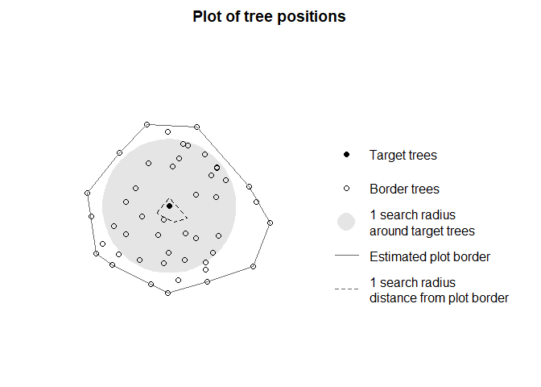

```{r, include=FALSE}
knitr::opts_chunk$set(
  collapse = TRUE,
  comment = "#>"
)
```

## Pre-processing of TLS or MLS point clouds

For extracting information on tree level from close-range laser scanning 
(TLS or MLS), you can use e.g. the [TreeLS](https://www.rdocumentation.org/packages/TreeLS/versions/2.0.2) package. 
We will show a workflow on how to implement the output of TreeLS within TreeCompR.

```{r setup, message=FALSE, warning=FALSE, eval=FALSE}
library(TreeCompR)
library(TreeLS)
```

First, load the .las data, normalize the height, sample the point cloud, estimate tree occurrence regions, classify stem points and estimate the diameter and height of each individual tree. 

```{r segment-TLS, message=FALSE, warning=FALSE, eval=FALSE}
    file <- "path/to/file"
    tls <- readTLS(file)
    tls_norm <- tlsNormalize(tls, keep_ground = F)
    thin <- tlsSample(tls_norm, smp.voxelize(0.01))
    map <- treeMap(thin, map.hough(min_density = 0.1), 0)
    tls_t <- treePoints(tls_norm, map, trp.crop())
    tls_stem <- stemPoints(tls_t, stm.hough())
    inv <- tlsInventory(tls_stem, d_method=shapeFit(shape='circle', 
                                                    algorithm = 'ransac'))
    inv$dbh <- (inv$Radius * 2)
    head(inv)
#>    TreeID         X          Y     Radius        Error        H h_radius        dbh
#> 1:      1 12.039168  3.3932670 0.44487714 0.0008539910 24.72817      1.3 0.88975428
#> 2:      2 11.930523  2.3763304 0.13060774 0.0005245504 24.98053      1.3 0.26121547
#> 3:      3  7.424479 -4.9563841 0.09487961 0.0003207291 23.75091      1.3 0.18975922
#> 4:      4  7.144895  5.8221160 0.49786606 0.0004321285 24.05617      1.3 0.99573212
#> 5:      5  7.085920  0.8309956 0.08171301 0.0002994584 24.07538      1.3 0.16342603
#> 6:      6  7.183327  5.2498770 0.04965389 0.0004974247 23.94043      1.3 0.09930777    
```


## Use extracted tree information within TreeCompR

To ensure that the inventory data is assigned correctly, check the data and make sure that you specify the units dbh and height if they differ from the default, which is cm for dbh and m for height. Use `read_inv()` to validate your inventory data within `TreeCompR`. To visually check for which trees the CIs will be quantified depending on the chosen search radius, you can use `define_target()` and `plot_target()`. We recommend to use `target_source = "buff_edge"` to automatically calculate the CI for all trees in the plot except for those that are less than one search radius away from the forest edge. This is specifically important for TLS/MLS data, since these data types usually only cover small forest plots rather than whole forests. 

```{r calculate-CI1, message=FALSE, warning=FALSE, eval=FALSE}
inventory <- read_inv(inv_source = inv, dbh_unit = "m", height_unit = "m")
targets <- define_target(inv = inventory, target_source = "buff_edge", radius = 10)
plot_target(targets)
```



```{r calculate-CI2, message=FALSE, warning=FALSE, eval=FALSE}
compete_inv(inventory, target_source = "buff_edge", radius = 7, 
              method = "all_methods")
#>--------------------------------------------------------------- 
#> 'target_inv' class inventory dataset with defined target trees: 
#> collection of 31 observations 
#> Source of target trees: buffer around edge 
#> ---------------------------------------------------------------
#>     id      x      y   dbh height target
#> 1    1 12.039  3.393  0.89 24.728  FALSE
#> 2    2 11.931  2.376 0.261 24.981  FALSE
#> 3    3  7.424 -4.956  0.19 23.751  FALSE
#>    ...    ...    ...   ...    ...    ...
#> 29  35 -6.407 -4.719  0.06 19.791  FALSE
#> 30  36 -7.484 -7.635 0.216 22.478  FALSE
#> 31  38 -5.287  1.051  0.06 22.923  FALSE
```

## Use cases

```{r use-cases, message=FALSE, warning=FALSE, eval=FALSE}
## If you focus on a specific CI, e.g. the widely used Hegyi-Index, 
## you can choose it within methods = "CI_Hegyi".
#> compete_inv(inventory, target_source = "buff_edge", radius = 7, 
#>              method = "CI_Hegyi")
#> The following columns were used to create the inventory dataset:
#> id	---	TreeID
#> x	---	X
#> y	---	Y
#> dbh	---	dbh
#> height	---	H
#> 
#> --------------------------------------------------------------------- 
#> 'compete_inv' class inventory with distance-based competition indices 
#> Collection of data for 1 target and 30 edge trees. 
#> Source of target trees: buffer around edge 	 Search radius: 7 
#> ---------------------------------------------------------------------
#>    id ...  dbh height CI_Hegyi CI_Braathe CI_RK1 CI_RK2 CI_RK3 CI_RK4
#> 18 20 ... 0.25   23.9     1.96       2.07   0.49  0.499    4.1   13.2

## If you have a tree height column that is not automatically recognized within 
## our validation of input data, you can set it manually:
# in read_inv():
inventory <- read_inv(inv_source = inventory, height = "h_column_name")

# in compete_inv():
compete_inv(inventory, target_source = "buff_edge", radius = 10, 
              height = "h_column_name", method = "CI_Hegyi")

## If your dbh is specified in cm, just change the dbh_unit to "cm"
compete_inv(inventory, target_source = "buff_edge", radius = 10, 
              dbh_unit = "cm", method = "CI_Hegyi")

## If you want to keep a column with certain user defined IDs for the trees, 
## and it is not recognized, specify it with id = "name_column"
inventory <- read_inv(inv_source = inventory, id = "ID_user")
```
