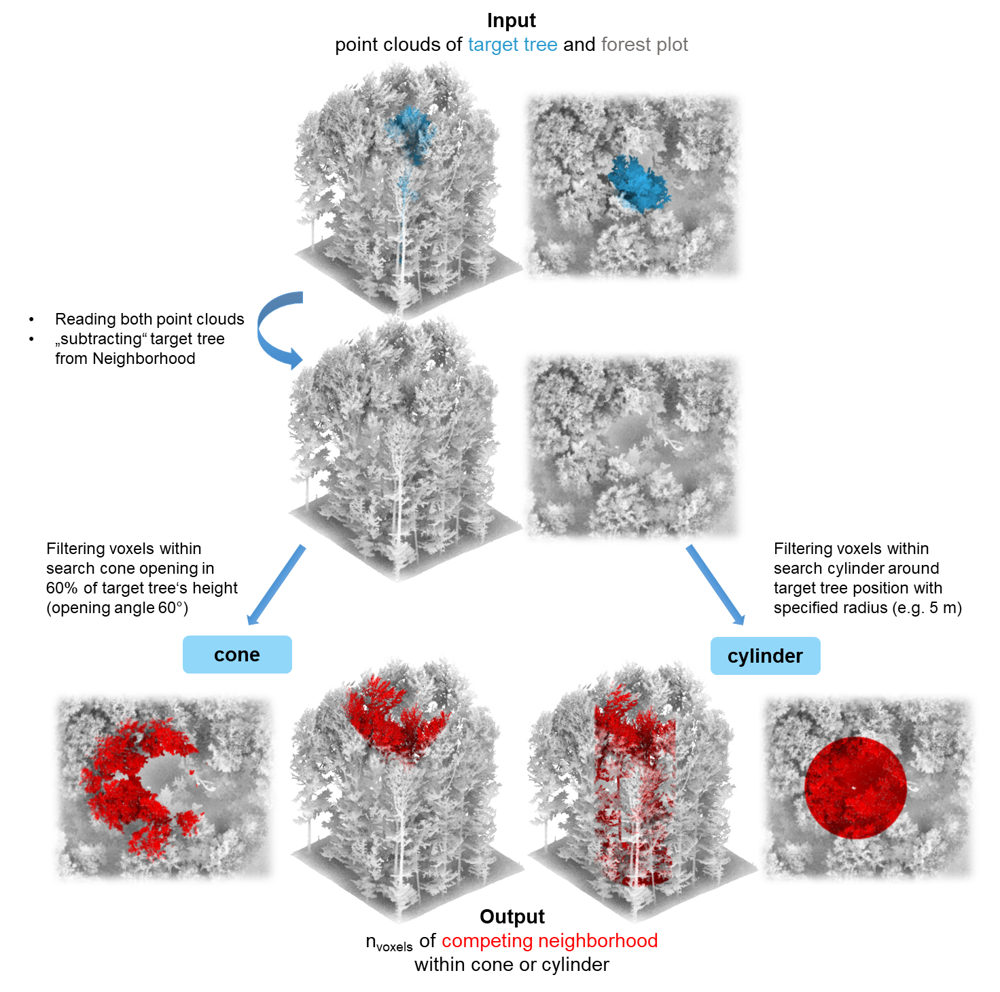
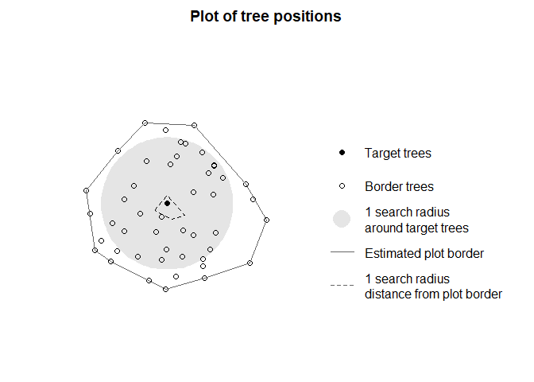

<!-- badges: start -->

R Package for calculating distance-dependent or point cloud-based individual tree competition indices

<!-- badges: end -->

This R package is designed for the quantitative analysis of individual tree competition within forest ecosystems. It accepts inputs such as LiDAR point clouds (as tabular data with x, y and z coordinates, .las/.laz files or .ply files) of forest plots and individual target trees, or inventory tables (including tree ID, x and y coordinates, diameter and/or tree height). Through the use of various competition indices, it enables the assessment and measurement of competition between trees, providing valuable insights for forest ecology, inventories, and forest management strategies. This package facilitates a systematic approach to understanding interactions and resource competition among trees and enables informed decision making in forest management.

## Installation

You can install the stable version (main branch) as well as the current development version of TreeCompR (development branch: more up-to-date, but potentially unstable) from [GitHub](https://github.com/juliarieder/TreeCompR) with:

``` r
# install.packages("devtools")

# get stable version
devtools::install_github("juliarieder/TreeCompR")

# get development branch 
devtools::install_github("juliarieder/TreeCompR", ref = "development")
```
## Overview

TreeCompR can read point clouds or inventory tables and quantify tree competition in different ways:

* Functions for __point-cloud based methods__
    * `compete_pc()` quantifies tree competition from point clouds using the cone or cylinder method (cf. Metz et al., [2013](https://doi.org/10.1016/j.foreco.2013.08.014); Seidel et al., [2015](http://dx.doi.org/10.1016/j.foreco.2014.10.020))
    * `read_pc()` reads 3D point clouds from .las/.laz files, .ply files and text-only file formats such as .txt or .csv, and converts LAS objects and data.frames to a TreeCompR compatible format
    * `tree_pos()` computes the base position and height of target tree point clouds
* Functions for __inventory-based methods__
    * `compete_inv()` quantifies size- and distance-dependent competition using inventory data based on a series of published indices
    * `read_inv()` reads and validates inventory tables from data.frames, or reads tabular data directly from text-only file sources such as .txt or .csv
    * `define_target()` can be used to define for which trees within a plot the competition should be quantified in `compete_inv()`
    * `plot_target()` check and validate the tree position(s) and the surrounding trees after defining them with `define_target()`


## Methodology of the point cloud-based approach

LiDAR point clouds can be used directly to quantify the competition exerted by neighboring trees on the target tree. For this purpose, the target tree for which the competition is to be determined should be segmented beforehand. Since it is crucial whether a part of the point cloud is classified as "competing" or as part of the target tree itself, a manual segmentation (e.g. in CloudCompare) is recommended as it tends to be much more accurate.



# Examples

## Point-cloud based tree competition metrics

With `compete_pc()`, it is easy to quantify the competition with `compete_pc()` for one target tree, in this example using the cone method (which counts the amount of voxels belonging to competitor trees situated in a cone opening at 60 % of the target tree's height in an angle of 60 degrees):

```{r example1, message=FALSE, warning=FALSE, eval=FALSE}
library(TreeCompR)
## insert path to point cloud of the forest plot and to the target tree 
compete_pc(forest_source = "../tests/testthat/testdata/neighborhood.txt", 
           tree_source = "../tests/testthat/testdata/tree.txt", 
           comp_method = "cone",
           h_cone = 0.6,
           print_progress = "none") # suppress messages

#>  ------------------------------------------------------------------
#>  Point cloud based competition indices for 'tree' 
#>  ------------------------------------------------------------------
#>   target height_target center_position CI_cone h_cone
#> 1   tree          22.8    crown center   16046    0.6
```

Equivalently, the cylinder method can be used to count the amount of voxels belonging to competitor trees within a cylinder around the target tree with 5 m radius.

```{r example2, message=FALSE, warning=FALSE, eval=FALSE}
## or the cylinder method with radius 5 m
compete_pc(forest_source = "../tests/testthat/testdata/neighborhood.las", 
           tree_source = "../tests/testthat/testdata/tree.las", 
           comp_method = "cylinder",
           cyl_r = 5,
           print_progress = "none") # suppress messages

#>  ------------------------------------------------------------------
#>  Point cloud based competition indices for 'tree' 
#>  ------------------------------------------------------------------
#>   target height_target center_position CI_cyl cyl_r
#> 1   tree          22.8    crown center 102169     5
```

While these examples use the default settings of `compete_pc()`, the function is highly customizable and able to deal with a large number of different file formats and object types, the majority of which are identified and read automatically. In cases where this is not possible due to non-standard file structures, point clouds can be loaded and pre-processed outside of `compete_pc()` using `read_pc()` with custom settings or other functions and then passed on to `compete_pc()`.


## Size- and distance-dependent tree competition metrics

Analogously, distance-dependent competition indices can be quantified using `compete_inv()`, which can read any text file with spatial positions of trees and measures of their size (conventionally, diameter at breast height or tree height). 

As it is usually not advisable to compute competition indices for all trees in a plot because there will be strong edge effects when the sample of trees does not comprise the entire forest stand, for `compete_inv()` it is necessary to explicitly specify target trees. In cases where these are not a priori defined by the design of the study, it is possible to automatically identify target trees using the `define_target()` function. 

In the following example, the inventory is first read with `read_inv()`, and then target trees are identified with `define_target()`. Again, `read_inv()` is highly customizable, and allows a large amount of different input formats and also manual identification of the names of the important variables (x and y coordinates and tree size).
 
```{r example3, message=FALSE, warning=FALSE, eval=FALSE}
## read forest inventory file from source
plot <- read_inv("../tests/testthat/testdata/inventory.csv", verbose = FALSE)
## define target trees
targets <- define_target(plot, target_source = "buff_edge", radius = 10)
```

With `target_source = "buff_edge`, target trees are defined as the trees who are in a distance of more than one search radius (in this case, 10 m) from the border of the forest stand (which is approximated by a concave hull). There are many other possible settings for `target_source`, such as specifying target trees by their IDs, by logical subsetting, or as a separate set of coordinates. It is also possible to define all trees as target trees, but unless your dataset contains all trees in the forest this is almost never a good idea due to the obvious edge effects. 

It is possible to plot the selection of target trees and the surrounding neighborhood for visual inspection using `plot_target()`:

```{r, fig1, fig.height=3, fig.width=6, eval=FALSE}
## plot the positions of the target trees and trees at the border
plot_target(targets)
```


In this example, the neighborhood was already chosen to only contain a single tree within a 10 m buffer from the border, so in consequence, only a single tree was identified as a potential target tree.

As the `target_inv` object that results from a call to `define_target()` contains the information about all trees in the plot as well as their status as target or neighbor tree, it can directly be fed to `compete_inv()` to calculate the competition indices for our one target tree without having to specify target trees explicitly: 

```{r example4, message=FALSE, warning=FALSE, eval=FALSE}
## insert path to inventory table or insert dataframe object
compete_inv(inv_source = targets,
            radius = 10, 
            method = "all")

#> --------------------------------------------------------------------- 
#> 'compete_inv' class inventory with distance-based competition indices 
#> Collection of data for 1 target and 47 edge trees. 
#> Source of target trees: buffer around edge    Search radius: 10 
#> ---------------------------------------------------------------------
#>    id     x      y   dbh CI_Hegyi CI_RK1 CI_RK2
#> 44 48 0.102 -0.494 0.244     4.39   1.07   1.58
```


Choosing `method = "all"` computes all available metrics for the chosen data source. As the dataset only contains diameters, but no tree heights, in this case it is the Hegyi index as well as the RK1 and RK2 indices (see documentation of `compete_inv()` and our paper for details).
