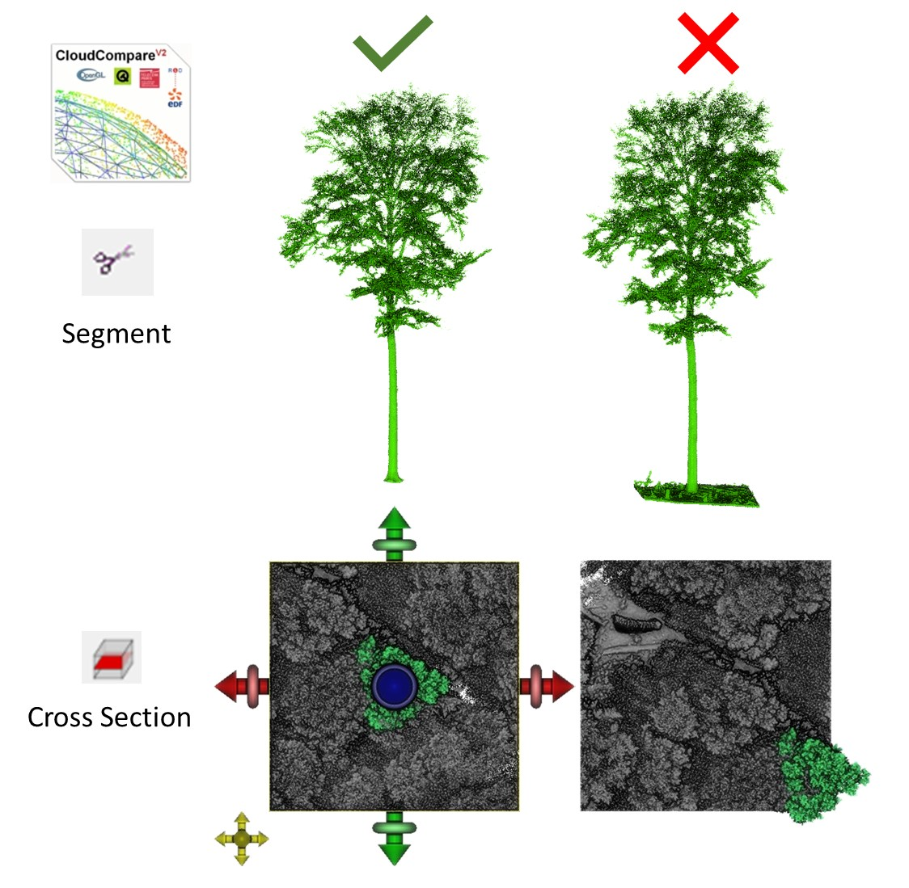

```{r, include=FALSE}
knitr::opts_chunk$set(
  collapse = TRUE,
  comment = "#>"
)
```
## Pre-process the point clouds

Before using the cone and cylinder point cloud approaches, the trees for which competition is to be quantified must be extracted from the plot. The most accurate (if time consuming) way to do this is by manual segmentation, for instance with [CloudCompare](https://www.danielgm.net/cc/). 

In CoudCompare, load your point cloud of the whole plot and use the [Segment](https://www.cloudcompare.org/doc/wiki/index.php/Interactive_Segmentation_Tool) function to extract the target tree. Make sure you do not miss any part or include neighbouring trees or their branches, as it is crucial to determine which parts of the point cloud belong to neighbours and which points belong to the target tree. Pay particular attention to the ground and don't include any ground points in your target tree's point cloud, otherwise the tree's base position may be determined imprecisely in later steps as the `tree_pos()` function is based on the lowest points in the point cloud of the target tree. 



After extracting the target tree, export the point cloud by selecting the file in the DB Tree and click File - Save. Do the same for the whole plot, but first clip the point cloud to your area of interest. The best way to do this is to select top view and use the [Cross Section](https://www.cloudcompare.org/doc/wiki/index.php/Cross_Section) function to clip your point cloud. Make sure that your target tree is not at the edge of the plot. For the example dataset in our paper, we used 30 x 30 m plots. 

When exporting/saving the point clouds, you can select .las/.laz, .txt, .csv, ... TreeCompR is flexible with file formats, but if possible use the same format for target trees and their neighbourhoods as there may be slight numeric differences between formats that complicate coordinate matching. 

After clicking save, you will be asked to select the output resolution. If you choose a custom resolution or coordinate accuracy, make sure you choose the same for the target tree and the neighbourhood cloud! In our examples, we rounded our coordinates to 2 decimal places (i.e. to 1 cm accuracy), which also is what the `compete_pc()` uses by default for coordinate matching, but other values are possible. 

## Quantify Competition with TreeCompR

Once you have the two point clouds for target tree and neighbourhood, you can use the `read_pc()` function of TreeCompR to read and validate them, or directly pass the paths to the point clouds to `compete_pc()`. 


In `compete_pc()`, you can select the method for computing competition indices by setting `comp_method` to `"cylinder"`, `"cone"` or `"both"`. To compute the competition indices for either of these methods, the position of the center of the cone or cylinder has to be defined. The `center_position` argument allows to center the cone or cylinder either around the central point of the crown projected area (`"crown_pos"`) or the central point of the tree base (`"base_pos"`). 
Usually, the position of a tree is calculated by using the lowest points of a tree and take the mean or median. However, if a tree is not growing straight and we want to identify (crown-)competition, we think it is more reasonable to instead focus on the center of the crown. For that reason, `compete_pc()` currently defaults to `center_position = "crown_pos"`, the median of the x and y position of the voxelized crown projected area (see the documentation of `tree_pos()` for details).

If you want to use the stem base position, there are additional parameters that you can adjust to ensure the correct position determination, namely `h_xy` (range in m above the lowermost point of the tree point cloud the base position should be calculated from) and `z_min` (minimum number of points in the lowermost layer of voxels used to calculate base position of the tree).
More about the methods themselves and the settings and sensitivity can be found in [Seidel et al. (2015)](https://doi.org/10.1016/j.foreco.2014.10.020), [Metz et al. (2013)](https://www.sciencedirect.com/science/article/pii/S0378112713005410), or, for the original KKL index, in [Pretzsch et al. (2002)](https://www.sciencedirect.com/science/article/pii/S0378112702000476). 

In the following example, the compete_pc is used to calculate both  cone and cylinder-based competition indices centered around the crown center, with a cone opening in a height of 0.6 times the total target tree height and a cylinder radius of 4 m:

```{r setup, message=FALSE, warning=FALSE, eval=FALSE}
library(TreeCompR)

CI <- compete_pc(forest_source = "../tests/testthat/testdata/neighborhood.txt", 
                tree_source = "../tests/testthat/testdata/tree.txt", 
                comp_method = "both", # calculate CI in cylinder and cone
                center_position = "crown_pos", # center for cone and cylinder
                cyl_r = 4, # radius in m
                h_cone = 0.6, # position where the cone starts to open relative
                # to the height of the target tree (0.6 = 60 % of tree height)
                print_progress = "some" # controls how much of the progress is
                )                       # printed
```

The result is an object of type `compete_pc`, i.e. a modified data.frame that you can save or use for further statistical analysis. It contains the name or ID (filename) of the tree, its height, the type center_position used, the computed competition index value(s) (voxel counts) and the settings of the parameters controlling cylinder and cone size.

If you want to use the same neighbourhood again because you have more than one target tree within that plot, you do not need to read the point cloud from the file each time. Instead, simply read it once with `read_pc()` and use it again. You can also load the target tree outside the `compete_pc()` function.

```{r neighbour, warning=FALSE, eval=FALSE}
neighbours <- read_pc("../tests/testthat/testdata/neighborhood.txt")
tree <- read_pc("../tests/testthat/testdata/tree.txt")

CI <- compete_pc(forest_source = neighbours, 
                tree_source = tree, 
                comp_method = "both", # calculate CI in cylinder and cone
                center_position = "crown_pos", #center for cone and cylinder
                cyl_r = 4, #radius in m
                h_cone = 0.6, #set height where the cone starts 
                #to open in relation to tree height (0.6 = 60 % of tree height)
                print_progress = "full" #get full information during processing
                )
```

Internally, `compete_pc()` crops the neighbourhood to the immediate surroundings of the cone or cylinder before matching the neighbour and tree point clouds as for large neighbourhoods this is the by far computationally most expensive step, while once a neighbourhood is loaded filtering (which is done efficiently using functions from the `data.table` package) is comparably fast. To speed up the coordinate matching, it is done on integer coordinates rounded to the digit accuracy specified by `acc_digits`, which defaults to 2 (round to cm). Should you have more accurate data, you can consider increasing that value, though it will slow down computations and likely will not have a large impact on the outcome as the competition indices are computed on a coarser spatial scale (by default 0.1 m). 

Since loading a large point cloud into memory has a considerable computational overhead and can take a lot of time (especially with older hard drives), loading a neighbourhood just once can speed up the analysis considerably when batch processing a large number of trees even if the neighbourhood is large. Should the objects become too large to handle within memory, we recommend to split them up outside R during the data preparation step.


## Example for batch-processing

If your study consists of many target trees and surrounding plots, it may be useful to create a lookup table to more efficiently run the function for all your trees. Here is an example of what such a lookup table might look like:
```{r lut, echo=FALSE, message=FALSE, warning=FALSE}
# Define the base paths
neighborhood_path <- "/path/to/neighborhood/"
trees_path <- "/path/to/trees/"

# Create example TreeIDs
TreeIDs <- paste0("Tree_", 1:5)

# Create example file paths
neighborhood_files <- paste0(neighborhood_path, "neighborhood_", 1:5, ".las")
tree_files <- paste0(trees_path, "tree_", 1:5, ".las")

# Create the lookup table as a data frame
lookup_table <- data.frame(
  TreeID = TreeIDs,
  forest_source = neighborhood_files,
  tree_source = tree_files,
  stringsAsFactors = FALSE
)


```

```{r lookup, echo = TRUE, eval=FALSE}

# Define the base paths
neighborhood_path <- "/path/to/neighborhood/"
trees_path <- "/path/to/trees/"

# List files in the neighborhood and tree folders
neighborhood_files <- list.files(neighborhood_path, full.names = TRUE, 
                                 pattern = "\\.las$")
tree_files <- list.files(trees_path, full.names = TRUE, pattern = "\\.las$")

# Create TreeIDs if needed
# Assuming the same number of neighborhood and tree files, 
#and each tree has a corresponding neighborhood file
TreeIDs <- paste0("Tree_", seq_along(neighborhood_files))

# Create the lookup table as a data frame
lookup_table <- data.frame(
  TreeID = TreeIDs,
  forest_source = neighborhood_files,
  tree_source = tree_files,
  stringsAsFactors = FALSE
)
```
```{r print lut}
# Print the lookup table
print(lookup_table)
```
In this case, the lookup table contains one path for each segmented target tree point cloud, and another path for the corresponding 30 x 30 m² neighbourhood. 

We can use `dplyr::mutate()` to append the function arguments for `compete_pc()`, and `purr::pmap()` to map over the paths and settings line by line and use `compete_pc()` with the settings specified in each of them. As this can take a considerable amount of time if processing hundreds of trees, the different options for `print_progress` can be useful to be able to keep track of the analysis and interrupt it in time if something goes wrong.


```{r batch, echo = TRUE, eval=FALSE}
#calculate both methods at the same time
library(dplyr)
lookup <- lookup_table %>% dplyr::select(forest_source, tree_source)
#define parameter settings within the lookup table
lookup_cone50_cyl5 <- lookup %>% dplyr::mutate(comp_method = "both", 
                                               center_position = "crown_pos", 
                                               cyl_r = 5, h_cone = 0.5, 
                                               z_min = 100, h_xy = 0.3, 
                                               print_progress = "some")
#use pmap (alternative to lapply) to loop over your table
lookup_results_cone50_cyl5 <- lookup_cone50_cyl5 %>% purrr::pmap(compete_pc)

#re-structure results from list to dataframe
results <- as.data.frame(do.call(rbind, lookup_results_cone50_cyl5))
```

 <!-- COMMENT: We absolutely need the output for the different steps of the analysis - look at TreeCompR.Rmd to see how you can do it easily. Also, why not simply use bind_rows(lookup_results_cone50_cyl5) instead of that weird  do.call based thing? that's how I did it in the examples, doesn't it work here? If we do not coerce to data.frame, we also keep printing as a compete_pc object which (hopefully) looks nicer than a raw data.frame output
I'd just go for "results <- lookup_cone50_cyl5 %>% purrr::pmap(compete_pc) %>% dplyr::bind_rows()
 for the sake of simplicity. -->
